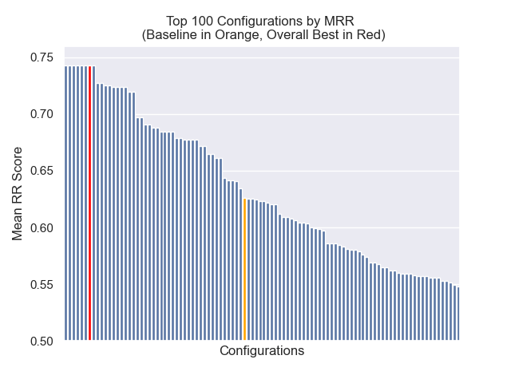
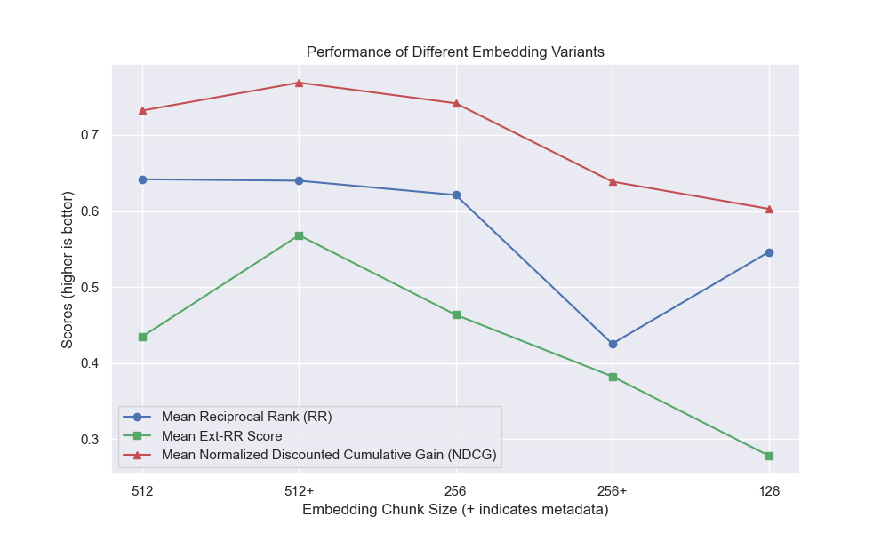

# Pawsitive Retrieval (Aware Data Project)

## Objective

Given an arbitrary user query and a dataset of human-generated content, build an algorithm to identify and rank the relevant content in the dataset, such that the match set can be retrieved quickly and accurately

We know that the eventual application for the results of our project is use in a Retrieval-Augmented Generation (RAG) pipeline. This [recent survey paper](https://arxiv.org/abs/2312.10997), describing the current state of RAG for Large Language Models (LLMs) helped provide some insight into what tools might be a good fit for our particular task and data.

The main steps in RAG are:

1. Indexing documents
2. Retrieving the most relevant documents, given a user query
3. Generating output using a LLM

## The Dataset

The raw data provided to us consists of 5,528,298 posts from Reddit, from 34 subreddits. This data was provided in a parquet file, along with a data dictionary.

## Our Approach

For this project, we are focussed on the first two steps of the RAG process: Indexing and retrieval.

### Indexing

#### Preprocessing of Data

Starting with the raw data, we performed some basic cleaning:

* Dropped rows with `reddit_text` values of `"[deleted]"` or `"removed"`.
* Dropped rows that were deemed to be likely bots or memes. 
  * This was done by filtering out any rows with `reddit_text` values that were at least 35 characters long, and appeared more than 7 times. We did not want to immediately drop shorter common phrases, in case they might be useful later (see Using Engineered Metadata).
* Handled empty `reddit_text` values.
  * There were hardly any comments (as opposed to submissions) that had empty values. Few enough that they could be inspected manually. It appeared that these posts had been either deleted, or edited so that they were empty by the original author. These rows were dropped.
  * A cursory inspection of submissions with empty values revealed that the `reddit_title` was a proxy for the `reddit_text`. So, we replaced the empty `reddit_text` with the `reddit_title` in these instances.

#### Embedding Model

We used the base version of the General Text Embeddings (GTE) model, which is based on the BERT framework. Documentation on HuggingFace: [link](https://huggingface.co/thenlper/gte-base).

We chose this model because it seemed to be a reasonable size (0.22GB), it is open source, and it allows embedding of texts up to 512 tokens in length. It performs especially well in clustering and retrieval compared to other open source sentence transformers that have fewer than 250M parameters: [link](https://huggingface.co/spaces/mteb/leaderboard).

Moreover, part of its training was done using Reddit data, which added to its appeal.

We considered experimentation with other models, but due to the high computational cost of embedding the dataset with each new model, we save this avenue for future work.

#### Embedding Parameters

We use the Sentence Transformers framework provided by SBERT to implement our embedding model: [link](https://www.sbert.net/).

During embedding we considered the following parameters:

* chunk_size: The maximum length of text to embed as a document
* chunk_overlap: Whenever a document needed to be broken into chunks, how much should they overlap

We also experimented with attaching metadata to chunks prior to embedding. To do this, we simply add the subreddit title (or an approximation) to the start of a text chunk before embedding. For example, if there is a comment in the FedExers that says “I really like working here because...” then we would append “FedEx” to the start of the chunk and embed “FedEx \n\n I really like working here because...”

Our intuition was that, in the cases where a post does not explicitly include the name of the company they are discussing, we might infer that information from the subreddit and that this might nudge that vector closer to our query. For example, If we ask “Why do employees like working at Disney?” and “Why do employees like working at FedEx?” our hope is that the addition of metadata makes it more likely that the above comment shows up higher in the results for the FedEx query, and maybe lower in the results for the Disney query.

#### Vector Database

We chose LanceDB ([link](https://lancedb.github.io/lancedb/)) to handle our vector database needs. LanceDB is an open source option, and it provides integration with both Python and Polars, both of which we are heavily reliant on.

##### ANN Index

LanceDB provides a combination of and inverted file index (IVF) and product quantization (PQ) to build an approximate nearest neighbors (ANN) index.

Both part of the IVF-PQ index can be fine tuned by adjusting the the following parameters:

* During indexing:
  * The number of partitions in the IVF portion of the index.
  * The number of sub-vectors that will be created during PQ.
* During retrieval:
  * The number of partitions to probe for results.
  * A "refine factor" that expands the number of results that are retrieves in memory, and re-ranked using their full (pre-PQ) vectors.

We fixed the indexing parameters, and varied the retrieval parameters. Though, if time permitted, we might vary both to see how retrieval times and accuracy are impacted.

### Retrieval

Besides the query parameters that are built into our ANN index, we varied other pre-retrieval and post-retrieval variables to try and improve our overall results.

#### Pre-retrieval

##### Prefiltering

While labeling data, we noticed a common type of "related but not relevant" result: a `reddit_text` that posed a question similar to the query itself.

Most of the time, these texts came from a `submission` (as opposed to a comment). So, one way to try and elevate more relevant results might be to omit these from the vector search. This is easy enough, given that this information is contained in our original metadata.

Less frequently, but still enough to be noticed, a `comment` would exhibit this property. To try and curb their impact, we engineered a metadata column `is_short_question` to try and identify all `reddit_text` examples that posed short questions (and thus were unlikely to provide useful information for answering those questions) so that they could also be filtered out before the search.

#### Post-retrieval

In order to improve the ranking of results after retrieval, we engineered some aditional metadata that might allow us to leverage information provided by the content of replies.

##### Using Engineered Metadata

We engineered two type of metadata:

1. A measure of `sentiment` of replies and,
2. A  measure of `agree_distance` (and `disagree_distance`) for replies.

In the case of `reply_sentiment`, our hypotheses was that a post with more positive replies would be more likely to contain useful information. We used .... ??@Karthik

In the case of  `agree_distance` we measured the distance between each `reddit_text` and a set of "agree statements". Then, whenever a submission or comment had replies, we added the `top_reply_agree_distance` and the `avg_reply_agree_distance`. Our hypothesis was that posts with replies that were closer to "agree" statements would be more likely to contain relevant information. Similarly, posts with replies that were closer to "disagree" statements would be less likely to be relevant.

When re-ranking, results with lower `avg_reply_agree_distance` were bumped higher, results with lower `avg_reply_disagree_distance` were bumped lower.

## Tested Configurations

We tested 160 different model configurations. Each configuration included a choice of embedding, a strategy for filtering the tests before performing our vector search, and a strategy for re-ranking the results that were retrieved. 

These hyper-parameters are summarized in the image below:

## Evaluating Results

We had two main objectives that we had in mind when evaluating our results:

1. We wanted query results to place relevant documents as high as possible in our ranking.
2. We wanted query results to be returned in less than a second.

While retrieval time is easy enough to measure, we needed to develop some tools to measure our progress on result ranking.

### Getting Labeled Data

To establish a baseline for evaluating result ranking, we manually labeled a subset of results to establish an initial metric of relevance. To do this, we created two queries for each of the thirteen datasets in our training set, and labeled the top 20 results retrieved for each query. Results were labeled as:

1. Relevant to the query
2. Related to the query, but not relevant to the query
3. Not related to the query

For each query-result pair, the final label was determined by plurality vote, with ties defaulting to less relevant. This manually labeled data was then used to quantify results.

### Quantifying Results

We used three metrics for ranking results. Each is a modified version of a recommender system metric, adapted to our use case where we do not have a clear ground truth, or an established ranking of relevant results from most relevant to least relevant.

#### Mean Reciprocal Rank

This metric gives a score that indicates how close the the top the first known relevant result appears. A perfect score of 1 is achieve is the top result of every query is relevant.

To compute reciprocal rank for a given query, we applied the following formula:
$$\text{RR}=\dfrac{1}{n}$$
where $n$ is the position at which the first known relevant result appears in the retrieved results. 

In [standard applications](https://en.wikipedia.org/wiki/Mean_reciprocal_rank), there is a single known "ground truth" result. In our modified application, we accepted any known relevant result as the ground truth.

We then computed the average of these scores across all of our standard queries to arrive at the Mean Reciprocal Rank.

#### Mean Extended Reciprocal Rank

This metric gives a score that indicates how many of our known relevant result appear near the top. A perfect score of 1 is achieved if all known relevant results appear as the top results for all queries (with no unlabeled result appearing higher than any known relevant result.)

To compute extended reciprocal rank for a given query, we applied the following formula:

$$\text{ExtRR}=\dfrac{1}{|K|}\sum_{K}k_i$$

where $K$ is the set of all known relevant results, and

$$k_i =  1  \text{ if }  n_i\leq|K| \text{, and } \dfrac{1}{|K|-n_i+1} \text{ otherwise,}$$

where $n_i$ is the position at which the known relevant  result, $k_i$, appears in the retrieved results.

In [standard applications](https://towardsdatascience.com/extended-reciprocal-rank-ranking-evaluation-metric-5929573c778a), each relevant result has its own rank, and its contribution to the overall score takes into account this rank as its expected position in the results. In our modified application, we gave the same contribution to any known relevant result that appeared above position $|K|$ in the results.

We then computed the average of these scores across all of our standard queries to arrive at the Mean Reciprocal Rank.

#### Normalized Discounted Cumulative Gain

[Discounted cumulative gain (DCG)](https://en.wikipedia.org/wiki/Discounted_cumulative_gain#cite_note-:0-2) is often employed as a metric to evaluate the performance of a search engine, and measures the efficiency of the algorithm in placing relevant results at the top of the retrieval list. For a list of responses of length $k$, DCG score at position $j$ is defined as

$$DCG_{j} = \sum_{i=1}^{j}\frac{rel_i}{log_{2}(i+1)}$$,

where $rel_{i}$ is the relevance score of the response at position $i$, and the logarithmic factor in the denominator (called the discount) ensures that [different ranking technqiues are consistent](https://arxiv.org/pdf/1304.6480) within this metric, and that highly relevant results appearing in the bottom of the retrieval list will contribute less to the score, than if they appeared higher.

Since the DCG score is strongly dependent on the length of the retrieval list, we need to normalize it so that scoring is consistent across query retrieval scenarios with variable number of results. The normalized discounted cumulative gain(NDCG) score at position $j$ is then defined as

$$NDCG_j = DCG_j/IDCG_j; ~~~~ IDCG_j = \sum_{i=1}^{j}\frac{rel_{i}^{Ideal}}{log_2(i+1)}$$ 

where the $rel_{i}^{Ideal}$ is the score in ideal scenario where all the relevant results are at the top of the list.

NDCG can take in ordinal relevance score (1 for highly relevant, 2 for somewhat relevant, so on). We modify the scoring scheme for our case, by converting our human labels (1-relevant, 2-related but not relevant, 3-not related) into a binary scoring scheme. Results with human label = 1 were given a relevance score =1, and everything else was given a relevance score of 0. This was done to ensure that the best configuration, as dictated by the NDCG score, should only return highly relevant results. We then computed the NDCG score of our standard queries and averaged them to obtain the mean NDCG score of a particular configuration. 

## Results and Conclusion

### Baseline

We used the following model parameters as our baseline for comparison:

* Chunk size for embedding: 512
* No attached metadata
* No pre-filtering before vector search
* No re-ranking of results

The baseline configuration achieve the following scores across our metrics:

| Metric                                    |   Score  | Rank (out of 160) |
|-------------------------------------------|:--------:|:-----------------:|
| Mean Reciprocal Rank                      | 0.626031 | 46                |
| Extended Mean Reciprocal Rank             | 0.427189 | 84                |
| Normalized Discounted Cumulative Gain     | 0.714459 | 84                |
| **Average Overall Rank**                  |          | **71.33**         |

### Top Overall Result

The configuration that achieved the best overall result (highest average rank across metrics):

* Chunk size for embedding: 512
* With attached metadata
* Pre-filtering short questions before vector search
* Re-ranking retrieved results using reply sentiment
* Re-ranking retrieved results using reply "agree distance"

This configuration achieve the following scores across our metrics:

| Metric                                    |   Score  | Rank (out of 160) |
|-------------------------------------------|:--------:|:-----------------:|
| Mean Reciprocal Rank                      | 0.742735 | 7                 |
| Extended Mean Reciprocal Rank             | 0.599379 | 9                 |
| Normalized Discounted Cumulative Gain     | 0.806476 | 1                 |
| **Average Overall Rank**                  |          | **5.67**          |

Below, we can see the relative position of the baseline configuration to the top overall.

### Parameters with the Biggest Impact

It appeared that decreased chunk size had a generally negative impact on results.

Also, filtering out short questions prior to retrieval had a positive impact regardless of other hyperparameter choices.

If we highlight just those configuration that contain these variations together (512 chunk size, with added metadata, and filtering by short questions) we see how well they perform relative to other configurations.

## Future Work

Some areas of potential future investigation:

* Preprocessing:
  * Handling emojis and common abbreviations to better capture sentiments.
* Labeling:
  * Label additional data, representing a wider range of query types and targeting a larger subset of the data.
  * Augment with automated labeling using an LLM or other means.
  * Rank relevant results (as opposed to simply categorizing as relevant versus irrelevant) so that we might apply metrics that detect more subtlety that might better quantify the impact of our engineered hyperparameter.
* Hyperparameter Engineering:
  * Refine short question filter to handle more nuance in what makes a short question.
  * Modify agree distances by varying the selection of standard "agree statements" (similarly for disagree distances).
  * Experiment with additional "reply distance" variations.
  * Experiment with re-ranking using a different chunk size than the primary embedding
* Indexing Parameters:
  * Test various parameters to see if retrieval times can be improved within top configurations.
* Re-ranking:
  * Refine re-ranking implementations and experiment with variations.
  * Experiment with the order of re-rankings to understand whether that has an impact on overall results.
